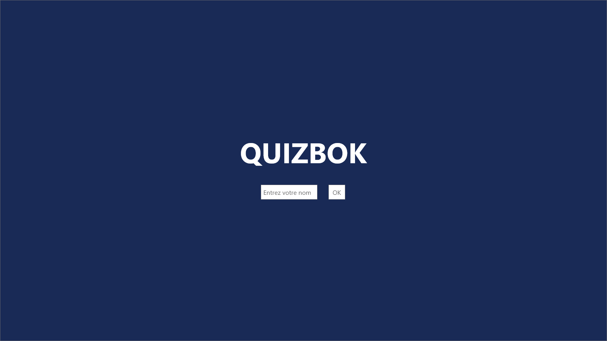
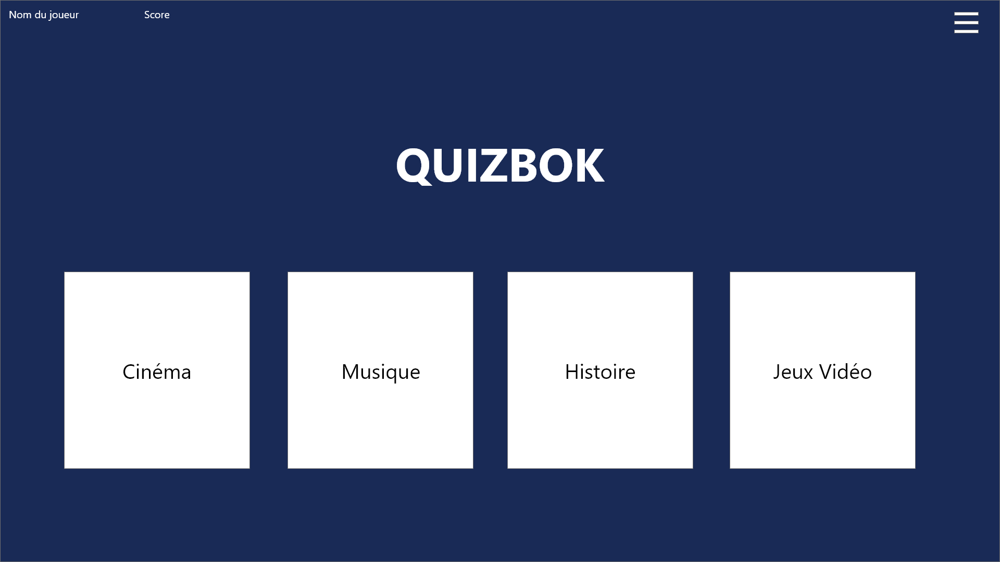

# QuizBok

# Présentation du projet

Un jeu de quiz.

# Langages

* HTML pour la structure des pages web
* CSS pour la mise en forme
* Flexbox / Media queries pour le responsive design
* JavaScript pour les interactions

# Déroulement du jeu

Une page qui permet de se connecter et de choisir un quiz.

Une page par question. Chaque question aura quatre réponses différentes, dont une correcte.

Incrémentation du score quand la réponse est correcte,

Décrémentation quand elle est incorrecte.

# Maquettes

* **Accueil**
    

* **Accueil, une fois connecté**
    

# Outils

* [Visual Studio Code](https://code.visualstudio.com/) pour l'éditeur de texte
* [Git](https://git-scm.com/) pour la gestion de versions
* [Git Bash](https://gitforwindows.org/) comme terminal de commande
* [GitHub](https://github.com/) pour partager le code en ligne
* [Google Chrome](https://www.google.fr/chrome/?brand=CHBD&gclid=CjwKCAjwpqv0BRABEiwA-TySweC2bONhPrgyuzbP4_9snC9rXGiS1lxTNuhsrfpnmj39i5z8PpHkJRoC7C0QAvD_BwE&gclsrc=aw.ds) comme navigateur
* [Google Fonts](https://fonts.google.com/) pour les polices
* [Flat ui colors](https://flatuicolors.com/) pour les couleurs
* [FileZilla](https://filezilla-project.org/) pour communiquer avec le serveur
* [Ionos](https://www.ionos.fr/) pour l'achat du nom de domaine
* [FreePng.fr](https://www.freepng.fr/) pour les PNG.

# Journal 2020

* **03 Aout**
    * Création de la page d'accueil.

* **04 Aout**
    * Refonte interface + Connexion du joueur.

* **05 Aout**
    * Déplacement du menu Burger dans le CSS.

* **06 Aout**
    * Ajout de la fonctionnalité web storage.
    * Refonte de la carte joueur.

* **07 Aout**
    * Ajout du menu Options.

* **09 Aout**
    * Création de maquette pour l'accueil.
    * Ajout de la maquette sur le README.

# Jouer

Jouer au jeu ici (version alpha) : [QuizBok](http://yannickbiheul.fr/quiz.html)
    
